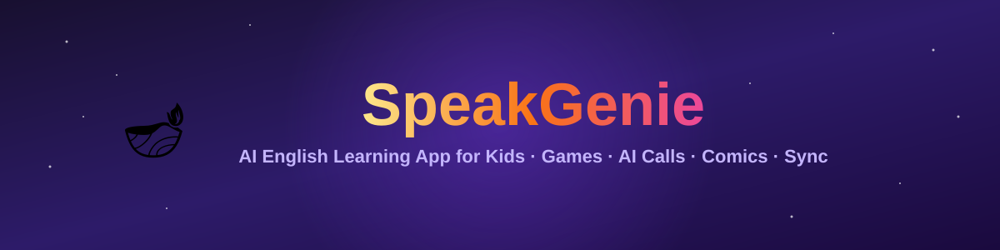
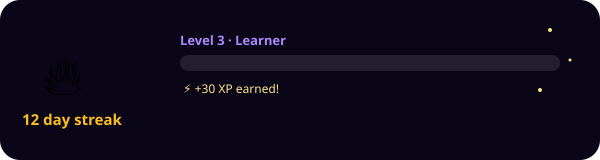
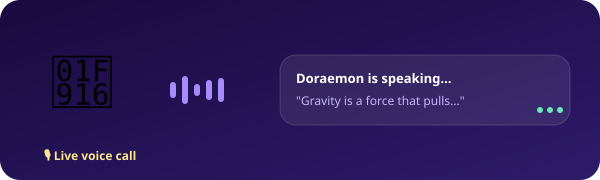

<p align="center">
  
</p>

<p align="center">
  
  
  
  
  
  
</p>

# 🪔 SpeakGenie

**An AI-powered English learning app for kids (ages 6–16)** — word games, AI hero voice calls, comics, spaced-repetition flashcards, daily quizzes, and a synced leaderboard, all in a single self-contained web app.

> Built as a single-file HTML/CSS/JS app backed by [Supabase](https://supabase.com) for auth, cross-device sync, and history tracking.

---

## 📊 By the Numbers

| | | | |
|---|---|---|---|
| 🦸 **6** AI heroes to call | 🎮 **8** games & activities | 🎨 **5** illustrated comics | 🃏 **20** flashcards (real SM-2) |
| 🧠 **5** rotating quiz banks | 🔗 **460+** word dictionary (Word Chain) | 📖 **3** reading passages | 📅 **7** rotating topics-of-the-day |
| 🏅 **8** real achievements | 🎭 **50** avatars | 📱 **25** app screens | ☁️ **100%** cloud-synced progress |

---

## 📸 Screenshots & Demos

> These two are illustrative animated mockups built from the app's real visual language (progress bars, streak flame, voice-call waveform) — swap them for actual screen recordings once you've deployed. Easiest way to get a real GIF: use a free tool like [ScreenToGif](https://www.screentogif.com/) (Windows) or [Kap](https://getkap.co/) (Mac), record the app in your browser, then drag the `.gif` into a GitHub Issue/PR text box to get a hosted URL to paste below.

<p align="center">
  
  
</p>

| Home | AI Hero Call | Word Games |
|---|---|---|
| _add screenshot/GIF_ | _add screenshot/GIF_ | _add screenshot/GIF_ |

| Comics | Flashcards | Leaderboard |
|---|---|---|
| _add screenshot/GIF_ | _add screenshot/GIF_ | _add screenshot/GIF_ |

---

## ✨ Features

### 🎮 Learning Activities
- **AI Hero Voice Calls** — talk to 6 AI characters (Doraemon, Spider-Man, Simba, Wizard Merlin, Fairy Luna, RoboTutor) using real speech recognition and text-to-speech. Each hero has topic-specific knowledge plus a shared general-knowledge base and short-term conversation memory for follow-up questions.
- **4 Word Games** — Word Hunt (word search grid), Word Jumble (unscramble), Word Guess (Wordle-style with correct duplicate-letter logic), Word Chain (last-letter-to-first-letter, validated against a 460+ word dictionary).
- **Flashcards** — real **SM-2 spaced repetition** algorithm. Each card tracks its own interval, ease factor, and due date; only genuinely due cards are shown.
- **Comics** — 5 illustrated grammar comics with canvas-drawn scenic backgrounds and named recurring characters, teaching nouns, verbs, adjectives, punctuation, and sentence structure.
- **Daily Quiz** — 5 rotating question banks (changes by calendar date), 30-second timer per question.
- **Reading Comprehension, Listen First, Vocabulary Match, Spelling Bee, Pronunciation Practice** — each with real speech recognition scoring or interactive validation.

### 📈 Progression & Motivation
- **Real level system** — XP-based leveling with title tiers (Beginner → Legend), progress bar, and an actual reward grant on level-up (not just a decorative popup).
- **Daily streaks & rewards** — 7-day rotating reward cycle that correctly increments on consecutive days and resets on missed days.
- **Achievements** — 8 badges tied to real tracked stats (streak length, calls made, quizzes passed, pronunciation attempts, games played, XP milestones, comics completed).
- **Dynamic leaderboard** — your real XP/streak is merged and sorted against a set of sample opponents.
- **Topic of the Day / Did You Know** — rotates daily using a deterministic date-seeded formula (not random — same topic all day, different topic tomorrow).

### ☁️ Accounts & Sync
- **Supabase Auth** (email + password) with Row Level Security — each user can only ever read/write their own data.
- **Cross-device sync** — XP, coins, streak, avatar, flashcard schedule, and pronunciation stats all persist to the cloud.
- **Offline guest mode** — play without an account; progress is cached locally and offered to sync later.
- **History screen** — past Daily Quiz results, comic completions, and Daily Bonus claims, each with **one-click deep links** that jump straight back into the matching activity.

---

## 🛠️ Tech Stack

| Layer | Technology |
|---|---|
| Frontend | Vanilla HTML / CSS / JavaScript — no build step, no framework, no bundler |
| Backend | [Supabase](https://supabase.com) (Postgres + Auth + Row Level Security) |
| Speech | Web Speech API (`SpeechSynthesis` + `SpeechRecognition`) — built into modern browsers |
| Graphics | HTML5 Canvas (story illustrations, comic scenes) |
| Hosting | Any static host — Netlify, Vercel, GitHub Pages, Cloudflare Pages |

There is genuinely no build pipeline. `index.html` is the entire application.

---

## 🚀 Getting Started

### 1. Clone this repo
```bash
git clone https://github.com/YOUR_USERNAME/speakgenie.git
cd speakgenie
```

### 2. Set up Supabase (required for accounts, sync, and history)

1. Create a free project at **[supabase.com](https://supabase.com)**.
2. Open **SQL Editor → New Query**, paste the entire contents of [`supabase_schema.sql`](./supabase_schema.sql), and run it. This creates:
   - `profiles` — XP, coins, streak, avatar, flashcard schedule, etc.
   - `daily_quiz_results` — one row per day per user
   - `comic_results` — one row per comic completion
   - `daily_bonus_history` — one row per claimed daily reward, with a deep-link target
   - Row Level Security policies so users can only ever access their own rows
3. Go to **Authentication → Providers → Email**, make sure **Email** is enabled, and toggle **off** "Confirm email" (unless you want users to verify their email before logging in).
4. Go to **Project Settings → API** and copy your **Project URL** and **anon public key**.

### 3. Add your credentials

Open `index.html`, find these two lines near the top of the `<script>` block, and fill in your own values:

```js
const SUPABASE_URL='YOUR_SUPABASE_PROJECT_URL';
const SUPABASE_ANON_KEY='YOUR_SUPABASE_ANON_KEY';
```

> ⚠️ The anon key is safe to expose in client-side code — that's what it's designed for — as long as Row Level Security is enabled on every table (the schema script does this for you).

### 4. Run it locally

Because the app calls out to Supabase, it must be served over `http://` or `https://` — **opening the file directly (`file://...`) will fail** with a "Failed to fetch" error.

```bash
python3 -m http.server 8000
# then open http://localhost:8000/index.html
```

or

```bash
npx serve .
```

---

## 🌐 Deployment

Any static host works. The simplest options:

### Netlify (fastest)
1. Go to **[app.netlify.com/drop](https://app.netlify.com/drop)**
2. Drag `index.html` onto the page
3. You get a live HTTPS URL instantly

### Vercel
1. `vercel.com` → **Add New → Project**
2. Import this repo, or upload the folder directly
3. Deploy — no build command needed (leave it blank / static)

### GitHub Pages
1. Push this repo to GitHub
2. **Settings → Pages → Source: Deploy from a branch → `main` / `root`**
3. Your app is live at `https://YOUR_USERNAME.github.io/speakgenie/`

### After deploying — update Supabase
Go to **Authentication → URL Configuration** in your Supabase dashboard and set **Site URL** (and Redirect URLs, if shown) to your live deployed URL. This keeps auth behaving correctly in production, not just on localhost.

---

## 📁 Project Structure

```
speakgenie/
├── index.html            # The entire application (HTML + CSS + JS, single file)
├── supabase_schema.sql   # Run once in Supabase SQL Editor to set up the database
├── README.md             # You are here
└── error-pages/          # Optional standalone 404 / 500 / 401 / 403 / offline pages
    ├── 404.html
    ├── 500.html
    ├── 401-unauthorized.html
    ├── 403-forbidden.html
    └── offline.html
```

---

## 🧩 How the App Is Organized (for contributors)

Everything lives in one `<script>` block inside `index.html`, structured roughly as:

- **State** — `APP` (xp, coins, streak, avatar...), `PROGRESS` (today's completed activities), `FC_STATE` (per-flashcard SM-2 schedule)
- **Auth** — Supabase Auth wiring (`doSignup`, `doLogin`, `doLogout`, `onAuthSuccess`, offline guest fallback)
- **Persistence** — `saveCurrentUserProfile()` syncs to Supabase every ~8s and on tab close; `saveOfflineGuestData()` mirrors the same shape to `localStorage` for guests
- **Router** — a single `go(screenName)` function toggles `.scr` screen `<div>`s and calls each screen's init function
- **Per-feature logic** — each game/activity is a self-contained block (state + render + scoring functions), e.g. `initWordHunt`/`whClick`, `getHeroAnswer`/`processCallUtterance`, `rateFC`/`updateFC`

---

## 🔧 Troubleshooting

| Symptom | Likely cause | Fix |
|---|---|---|
| **"Failed to fetch"** on signup/login | Page opened via `file://` instead of a server | Serve it with `python3 -m http.server` or deploy it — never double-click the file |
| **"Email signups are disabled"** | The Email provider is toggled off in Supabase | Authentication → Providers → Email → enable it |
| **"⚠️ Cloud sync not configured"** badge | Placeholder `SUPABASE_URL`/`SUPABASE_ANON_KEY` were never replaced | Fill in your real project credentials |
| Signup succeeds but login seems stuck | "Confirm email" is on and no email arrived | Authentication → Providers → Email → toggle off "Confirm email" (or set up a real email provider) |
| Works locally, breaks after deploying | Supabase Site URL still points at `localhost` | Authentication → URL Configuration → update Site URL to your live domain |

---

## 🗺️ Known Limitations / Roadmap

This is a client-side app with no custom backend server — Supabase provides the database and auth, but there is no server-side business logic. Known constraints:

- Speech recognition/synthesis quality depends on the browser (best in Chrome; degraded or unavailable in some others).
- The leaderboard blends real users with a small set of fixed sample opponents rather than querying every real user globally.
- No automated test suite yet — changes should be manually verified across the main screens (Home, AI Calls, Games, Flashcards, Quiz, Leaderboard, Profile, History) before deploying.
- No content moderation on the free-text AI hero chat input.

Contributions addressing any of the above are welcome.

---

## 🤝 Contributing

1. Fork the repo
2. Make your changes directly in `index.html` (there's no build step to run)
3. Test locally via `python3 -m http.server` before opening a PR
4. Open a pull request describing what changed and why

---

## 📄 License

MIT — free to use, modify, and distribute. See `LICENSE` for details (add one if you haven't yet — [choosealicense.com](https://choosealicense.com) can help you pick).

---

*Built with 🪔 for young English learners everywhere.*
